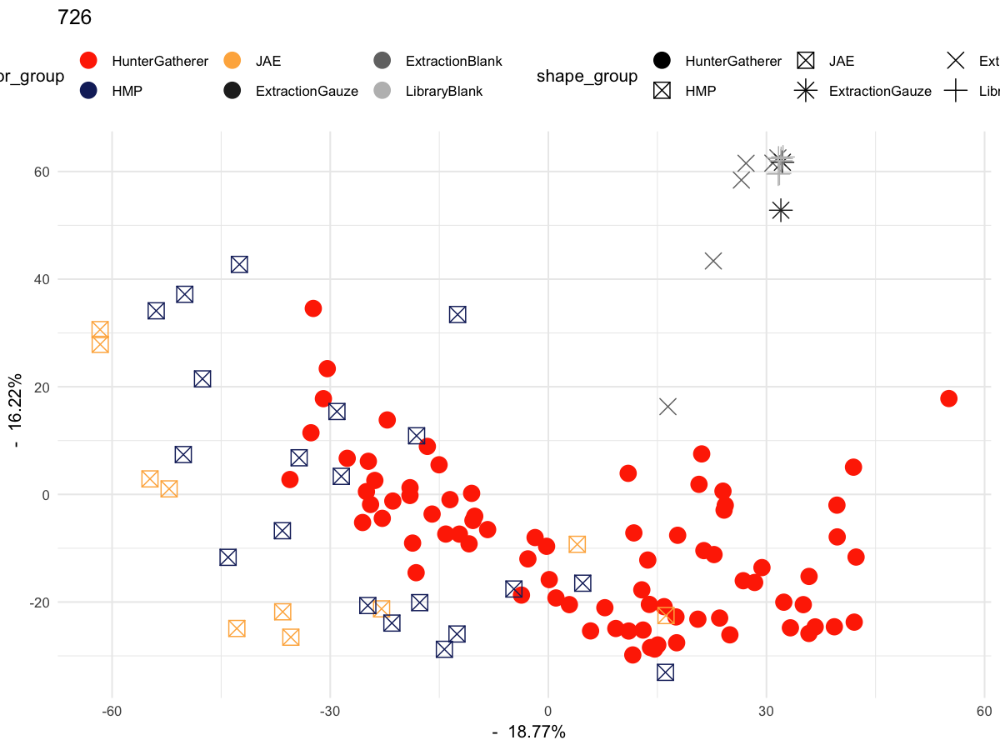
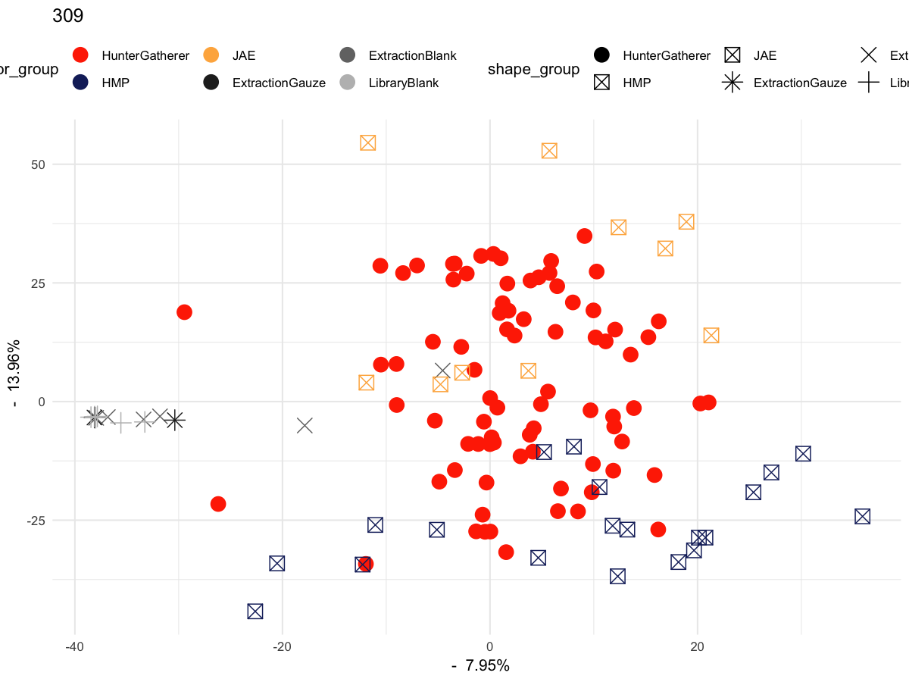
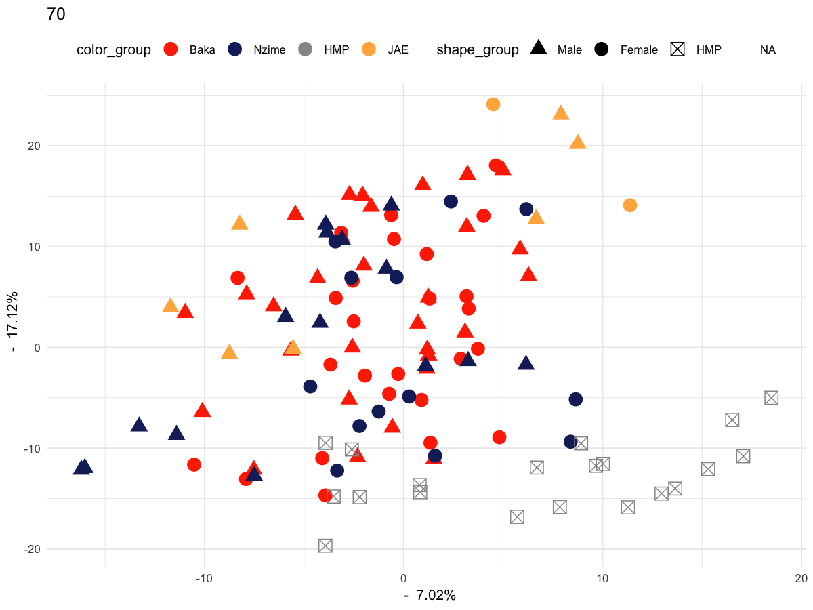
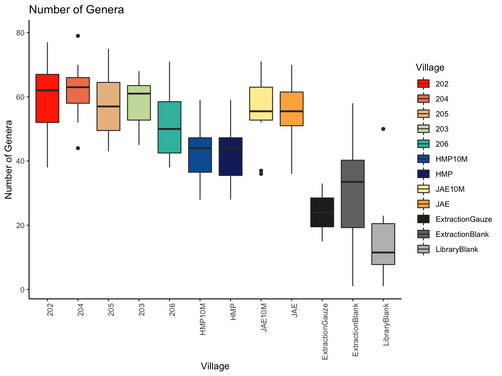

Cameroon hunter-gatherer calculus/plaque MALT
================
Irina Velsko
Nov 21, 2019

-   [MALT read stats](#malt-read-stats)
-   [Decontamination with Decontam](#decontamination-with-decontam)

    ## Warning: package 'knitr' was built under R version 3.4.3

    ## Warning: package 'data.table' was built under R version 3.4.4

    ## Warning: package 'psych' was built under R version 3.4.4

    ## Warning: package 'mixOmics' was built under R version 3.4.4

    ## Loading required package: MASS

    ## Loading required package: lattice

    ## Loading required package: ggplot2

    ## Warning: package 'ggplot2' was built under R version 3.4.4

    ## 
    ## Attaching package: 'ggplot2'

    ## The following objects are masked from 'package:psych':
    ## 
    ##     %+%, alpha

    ## This version of Shiny is designed to work with 'htmlwidgets' >= 1.5.
    ##     Please upgrade via install.packages('htmlwidgets').

    ## 
    ## Loaded mixOmics 6.3.2
    ## 
    ## Thank you for using mixOmics!
    ## 
    ## How to apply our methods: http://www.mixOmics.org for some examples.
    ## Questions or comments: email us at mixomics[at]math.univ-toulouse.fr  
    ## Any bugs? https://bitbucket.org/klecao/package-mixomics/issues
    ## Cite us:  citation('mixOmics')

    ## 
    ## Attaching package: 'mixOmics'

    ## The following object is masked from 'package:psych':
    ## 
    ##     pca

    ## Warning: package 'compositions' was built under R version 3.4.4

    ## Loading required package: tensorA

    ## Warning: package 'tensorA' was built under R version 3.4.4

    ## 
    ## Attaching package: 'tensorA'

    ## The following object is masked from 'package:base':
    ## 
    ##     norm

    ## Loading required package: robustbase

    ## Warning: package 'robustbase' was built under R version 3.4.4

    ## 
    ## Attaching package: 'robustbase'

    ## The following object is masked from 'package:psych':
    ## 
    ##     cushny

    ## Loading required package: energy

    ## Warning: package 'energy' was built under R version 3.4.4

    ## Loading required package: bayesm

    ## Warning: package 'bayesm' was built under R version 3.4.4

    ## Welcome to compositions, a package for compositional data analysis.
    ## Find an intro with "? compositions"

    ## 
    ## Attaching package: 'compositions'

    ## The following object is masked from 'package:psych':
    ## 
    ##     ellipses

    ## The following objects are masked from 'package:stats':
    ## 
    ##     cor, cov, dist, var

    ## The following objects are masked from 'package:base':
    ## 
    ##     %*%, scale, scale.default

    ## Warning: package 'vegan' was built under R version 3.4.3

    ## Loading required package: permute

    ## This is vegan 2.4-6

    ## 
    ## Attaching package: 'janitor'

    ## The following objects are masked from 'package:stats':
    ## 
    ##     chisq.test, fisher.test

    ## ── Attaching packages ─────────────────────────────────────────────────────────────────────────────────────────────────────────────── tidyverse 1.2.1 ──

    ## ✔ tibble  2.1.1     ✔ purrr   0.3.0
    ## ✔ tidyr   0.8.2     ✔ dplyr   0.8.3
    ## ✔ readr   1.3.1     ✔ stringr 1.3.0
    ## ✔ tibble  2.1.1     ✔ forcats 0.4.0

    ## Warning: package 'tibble' was built under R version 3.4.4

    ## Warning: package 'tidyr' was built under R version 3.4.4

    ## Warning: package 'readr' was built under R version 3.4.4

    ## Warning: package 'purrr' was built under R version 3.4.4

    ## Warning: package 'stringr' was built under R version 3.4.3

    ## Warning: package 'forcats' was built under R version 3.4.4

    ## ── Conflicts ────────────────────────────────────────────────────────────────────────────────────────────────────────────────── tidyverse_conflicts() ──
    ## ✖ ggplot2::%+%()     masks psych::%+%()
    ## ✖ ggplot2::alpha()   masks psych::alpha()
    ## ✖ dplyr::between()   masks data.table::between()
    ## ✖ dplyr::filter()    masks stats::filter()
    ## ✖ dplyr::first()     masks data.table::first()
    ## ✖ dplyr::lag()       masks stats::lag()
    ## ✖ dplyr::last()      masks data.table::last()
    ## ✖ purrr::map()       masks mixOmics::map()
    ## ✖ dplyr::select()    masks MASS::select()
    ## ✖ purrr::transpose() masks data.table::transpose()

    ## Warning: package 'gplots' was built under R version 3.4.4

    ## 
    ## Attaching package: 'gplots'

    ## The following object is masked from 'package:stats':
    ## 
    ##     lowess

    ## Warning: package 'viridis' was built under R version 3.4.3

    ## Loading required package: viridisLite

    ## Warning: package 'viridisLite' was built under R version 3.4.3

    ## 
    ## Attaching package: 'cowplot'

    ## The following object is masked from 'package:ggplot2':
    ## 
    ##     ggsave

Set the working directory of the notebook to the parent directory of the notebook itself.

MALT read stats
===============

The number of reads assigned in each sample appears very low (~50%). We want to check this so we know how many were assinged in each sample. We used the cleaned and merged reads that didn't align to the human genome (hg19), with the following database: /projects1/malt/databases/indexed/index040/full-nt\_2017-10.

Before running decontam, let's plot the samples in a PCA to see if there are any that are clearly not good-quality

    ## Eigenvalues for the first 10 principal components, see object$sdev^2: 
    ##       PC1       PC2       PC3       PC4       PC5       PC6       PC7 
    ## 969.31612 774.14803 500.24236 210.07711 171.24839 159.45754 121.83715 
    ##       PC8       PC9      PC10 
    ## 107.35217  86.15156  80.65793 
    ## 
    ## Proportion of explained variance for the first 10 principal components, see object$explained_variance: 
    ##        PC1        PC2        PC3        PC4        PC5        PC6 
    ## 0.19829999 0.15837305 0.10233819 0.04297699 0.03503352 0.03262138 
    ##        PC7        PC8        PC9       PC10 
    ## 0.02492511 0.02196181 0.01762465 0.01650077 
    ## 
    ## Cumulative proportion explained variance for the first 10 principal components, see object$cum.var: 
    ##       PC1       PC2       PC3       PC4       PC5       PC6       PC7 
    ## 0.1983000 0.3566730 0.4590112 0.5019882 0.5370217 0.5696431 0.5945682 
    ##       PC8       PC9      PC10 
    ## 0.6165300 0.6341547 0.6506555 
    ## 
    ##  Other available components: 
    ##  -------------------- 
    ##  loading vectors: see object$rotation

    ## 
    ## Call:
    ##  tune.pca(X = malt_species_raw, logratio = "CLR") 
    ## 
    ##  for all principal components, see object$sdev, object$explained_variance and object$cum.var

List the outliers in the plot above and remove them before running decontam to ensure they're not influencing the contaminant assessment.

Decontamination with Decontam
=============================

We want to know if there are any species that can be removed b/c they appear to be contaminants. Use the package decontam to determine which species may be contaminants. Prepare the matrix for decontam.

Make a species abundance curve for the samples based on Env to get an idea of the number of species identified in each prior to filtering, and how long the tail is. 

Now we're ready to run Decontam. Start with the frequency method.

Try the prevalence method to compare.

    ## 
    ## FALSE  TRUE 
    ##   726   279

    ## 
    ## FALSE  TRUE 
    ##   178   166

Check the rank abundance curves to see how changing the cut-off threshold changes the tail. 

Check the combined prevalence and frequency method to see how it differs from the individual methods.

We'll use the prevalence method, because this doesn't include known oral taxa in the contaminant list (frequency method does), and it picks up a lot more than the combined method does (but is that important if we cut off the tail of low-abundance taxa (say &lt;0.01% abundance) anyway?). But which cut-off to use? How does changing the cut-off affect the tail of low-abundance taxa? List out the pathways that are considered contaminants, to be removed from the table prior to all analyses. Then remove them from the table to make the decontaminated input table for analysis.

Let's do a quick and not at all enough data filtering so we can run a quick PCA to see if there are trends

    ## Eigenvalues for the first 10 principal components, see object$sdev^2: 
    ##        PC1        PC2        PC3        PC4        PC5        PC6 
    ## 1119.26494  770.18474  481.92930  197.41577  161.52625  153.08104 
    ##        PC7        PC8        PC9       PC10 
    ##  111.83260   94.10515   79.52017   70.09306 
    ## 
    ## Proportion of explained variance for the first 10 principal components, see object$explained_variance: 
    ##        PC1        PC2        PC3        PC4        PC5        PC6 
    ## 0.22678484 0.15605441 0.09764825 0.04000027 0.03272836 0.03101719 
    ##        PC7        PC8        PC9       PC10 
    ## 0.02265946 0.01906753 0.01611233 0.01420222 
    ## 
    ## Cumulative proportion explained variance for the first 10 principal components, see object$cum.var: 
    ##       PC1       PC2       PC3       PC4       PC5       PC6       PC7 
    ## 0.2267848 0.3828392 0.4804875 0.5204878 0.5532161 0.5842333 0.6068928 
    ##       PC8       PC9      PC10 
    ## 0.6259603 0.6420726 0.6562749 
    ## 
    ##  Other available components: 
    ##  -------------------- 
    ##  loading vectors: see object$rotation

    ## 
    ## Call:
    ##  tune.pca(X = malt_species_unfiltered, logratio = "CLR") 
    ## 
    ##  for all principal components, see object$sdev, object$explained_variance and object$cum.var

    ## Eigenvalues for the first 10 principal components, see object$sdev^2: 
    ##       PC1       PC2       PC3       PC4       PC5       PC6       PC7 
    ## 749.57895 457.22459 367.49560 179.47474 136.35750 128.26386  89.74465 
    ##       PC8       PC9      PC10 
    ##  74.52454  62.13476  58.42370 
    ## 
    ## Proportion of explained variance for the first 10 principal components, see object$explained_variance: 
    ##        PC1        PC2        PC3        PC4        PC5        PC6 
    ## 0.21480123 0.13102343 0.10531046 0.05143073 0.03907495 0.03675561 
    ##        PC7        PC8        PC9       PC10 
    ## 0.02571745 0.02135594 0.01780549 0.01674204 
    ## 
    ## Cumulative proportion explained variance for the first 10 principal components, see object$cum.var: 
    ##       PC1       PC2       PC3       PC4       PC5       PC6       PC7 
    ## 0.2148012 0.3458247 0.4511351 0.5025658 0.5416408 0.5783964 0.6041139 
    ##       PC8       PC9      PC10 
    ## 0.6254698 0.6432753 0.6600173 
    ## 
    ##  Other available components: 
    ##  -------------------- 
    ##  loading vectors: see object$rotation

    ## 
    ## Call:
    ##  tune.pca(X = malt_species_filtered, logratio = "CLR") 
    ## 
    ##  for all principal components, see object$sdev, object$explained_variance and object$cum.var

    ## Eigenvalues for the first 10 principal components, see object$sdev^2: 
    ##       PC1       PC2       PC3       PC4       PC5       PC6       PC7 
    ## 784.80276 678.18871 466.11693 188.43962 153.81585 137.35310 100.72423 
    ##       PC8       PC9      PC10 
    ##  82.70991  70.07698  64.05332 
    ## 
    ## Proportion of explained variance for the first 10 principal components, see object$explained_variance: 
    ##        PC1        PC2        PC3        PC4        PC5        PC6 
    ## 0.18772491 0.16222281 0.11149522 0.04507478 0.03679277 0.03285488 
    ##        PC7        PC8        PC9       PC10 
    ## 0.02409325 0.01978422 0.01676242 0.01532156 
    ## 
    ## Cumulative proportion explained variance for the first 10 principal components, see object$cum.var: 
    ##       PC1       PC2       PC3       PC4       PC5       PC6       PC7 
    ## 0.1877249 0.3499477 0.4614429 0.5065177 0.5433105 0.5761654 0.6002586 
    ##       PC8       PC9      PC10 
    ## 0.6200428 0.6368052 0.6521268 
    ## 
    ##  Other available components: 
    ##  -------------------- 
    ##  loading vectors: see object$rotation

    ## 
    ## Call:
    ##  tune.pca(X = malt_species.decontam_unfilt, logratio = "CLR") 
    ## 
    ##  for all principal components, see object$sdev, object$explained_variance and object$cum.var

    ## Eigenvalues for the first 10 principal components, see object$sdev^2: 
    ##       PC1       PC2       PC3       PC4       PC5       PC6       PC7 
    ## 733.55067 444.91763 253.35043 173.60242 123.66338 113.71238  77.82181 
    ##       PC8       PC9      PC10 
    ##  69.21329  58.55337  53.53405 
    ## 
    ## Proportion of explained variance for the first 10 principal components, see object$explained_variance: 
    ##        PC1        PC2        PC3        PC4        PC5        PC6 
    ## 0.23015389 0.13959434 0.07948951 0.05446832 0.03879979 0.03567763 
    ##        PC7        PC8        PC9       PC10 
    ## 0.02441684 0.02171589 0.01837131 0.01679648 
    ## 
    ## Cumulative proportion explained variance for the first 10 principal components, see object$cum.var: 
    ##       PC1       PC2       PC3       PC4       PC5       PC6       PC7 
    ## 0.2301539 0.3697482 0.4492377 0.5037061 0.5425059 0.5781835 0.6026003 
    ##       PC8       PC9      PC10 
    ## 0.6243162 0.6426875 0.6594840 
    ## 
    ##  Other available components: 
    ##  -------------------- 
    ##  loading vectors: see object$rotation

    ## 
    ## Call:
    ##  tune.pca(X = malt_species.decontam_filtered, logratio = "CLR") 
    ## 
    ##  for all principal components, see object$sdev, object$explained_variance and object$cum.var

    ## Eigenvalues for the first 10 principal components, see object$sdev^2: 
    ##       PC1       PC2       PC3       PC4       PC5       PC6       PC7 
    ## 471.26807 164.06881 131.59519  62.93929  51.70726  38.22573  34.31168 
    ##       PC8       PC9      PC10 
    ##  27.33105  24.17536  22.92377 
    ## 
    ## Proportion of explained variance for the first 10 principal components, see object$explained_variance: 
    ##        PC1        PC2        PC3        PC4        PC5        PC6 
    ## 0.31327216 0.10906360 0.08747698 0.04183845 0.03437204 0.02541029 
    ##        PC7        PC8        PC9       PC10 
    ## 0.02280845 0.01816812 0.01607040 0.01523841 
    ## 
    ## Cumulative proportion explained variance for the first 10 principal components, see object$cum.var: 
    ##       PC1       PC2       PC3       PC4       PC5       PC6       PC7 
    ## 0.3132722 0.4223358 0.5098127 0.5516512 0.5860232 0.6114335 0.6342420 
    ##       PC8       PC9      PC10 
    ## 0.6524101 0.6684805 0.6837189 
    ## 
    ##  Other available components: 
    ##  -------------------- 
    ##  loading vectors: see object$rotation

    ## 
    ## Call:
    ##  tune.pca(X = malt_genus_unfiltered, logratio = "CLR") 
    ## 
    ##  for all principal components, see object$sdev, object$explained_variance and object$cum.var

    ## Eigenvalues for the first 10 principal components, see object$sdev^2: 
    ##       PC1       PC2       PC3       PC4       PC5       PC6       PC7 
    ## 154.00072 124.25243 107.02000  42.84755  33.02007  30.68731  21.35990 
    ##       PC8       PC9      PC10 
    ##  18.94178  17.51918  15.10304 
    ## 
    ## Proportion of explained variance for the first 10 principal components, see object$explained_variance: 
    ##        PC1        PC2        PC3        PC4        PC5        PC6 
    ## 0.19571606 0.15790962 0.13600932 0.05445399 0.04196446 0.03899981 
    ##        PC7        PC8        PC9       PC10 
    ## 0.02714581 0.02407269 0.02226473 0.01919411 
    ## 
    ## Cumulative proportion explained variance for the first 10 principal components, see object$cum.var: 
    ##       PC1       PC2       PC3       PC4       PC5       PC6       PC7 
    ## 0.1957161 0.3536257 0.4896350 0.5440890 0.5860534 0.6250532 0.6521991 
    ##       PC8       PC9      PC10 
    ## 0.6762717 0.6985365 0.7177306 
    ## 
    ##  Other available components: 
    ##  -------------------- 
    ##  loading vectors: see object$rotation

    ## 
    ## Call:
    ##  tune.pca(X = malt_genus_filtered, logratio = "CLR") 
    ## 
    ##  for all principal components, see object$sdev, object$explained_variance and object$cum.var

    ## Eigenvalues for the first 10 principal components, see object$sdev^2: 
    ##       PC1       PC2       PC3       PC4       PC5       PC6       PC7 
    ## 213.08945 141.05686 115.57819  41.81480  35.81517  28.38044  22.86255 
    ##       PC8       PC9      PC10 
    ##  20.57632  18.39513  17.71219 
    ## 
    ## Proportion of explained variance for the first 10 principal components, see object$explained_variance: 
    ##        PC1        PC2        PC3        PC4        PC5        PC6 
    ## 0.22654876 0.14996640 0.12287843 0.04445594 0.03807735 0.03017303 
    ##        PC7        PC8        PC9       PC10 
    ## 0.02430661 0.02187598 0.01955702 0.01883094 
    ## 
    ## Cumulative proportion explained variance for the first 10 principal components, see object$cum.var: 
    ##       PC1       PC2       PC3       PC4       PC5       PC6       PC7 
    ## 0.2265488 0.3765152 0.4993936 0.5438495 0.5819269 0.6120999 0.6364065 
    ##       PC8       PC9      PC10 
    ## 0.6582825 0.6778395 0.6966704 
    ## 
    ##  Other available components: 
    ##  -------------------- 
    ##  loading vectors: see object$rotation

    ## 
    ## Call:
    ##  tune.pca(X = malt_genus.decontam_unfiltered, logratio = "CLR") 
    ## 
    ##  for all principal components, see object$sdev, object$explained_variance and object$cum.var

    ## Eigenvalues for the first 10 principal components, see object$sdev^2: 
    ##       PC1       PC2       PC3       PC4       PC5       PC6       PC7 
    ## 137.26471 107.66659  45.55686  39.21912  28.33795  24.51967  20.36455 
    ##       PC8       PC9      PC10 
    ##  17.16748  16.03156  15.64737 
    ## 
    ## Proportion of explained variance for the first 10 principal components, see object$explained_variance: 
    ##        PC1        PC2        PC3        PC4        PC5        PC6 
    ## 0.21550583 0.16903672 0.07152434 0.06157409 0.04449064 0.03849592 
    ##        PC7        PC8        PC9       PC10 
    ## 0.03197238 0.02695297 0.02516958 0.02456639 
    ## 
    ## Cumulative proportion explained variance for the first 10 principal components, see object$cum.var: 
    ##       PC1       PC2       PC3       PC4       PC5       PC6       PC7 
    ## 0.2155058 0.3845425 0.4560669 0.5176410 0.5621316 0.6006275 0.6325999 
    ##       PC8       PC9      PC10 
    ## 0.6595529 0.6847225 0.7092889 
    ## 
    ##  Other available components: 
    ##  -------------------- 
    ##  loading vectors: see object$rotation

    ## 
    ## Call:
    ##  tune.pca(X = malt_genus.decontam_filtered, logratio = "CLR") 
    ## 
    ##  for all principal components, see object$sdev, object$explained_variance and object$cum.var

    ## Eigenvalues for the first 10 principal components, see object$sdev^2: 
    ##       PC1       PC2       PC3       PC4       PC5       PC6       PC7 
    ## 827.01455 518.05377 225.29894 196.81998 150.52176 137.26352 101.97794 
    ##       PC8       PC9      PC10 
    ##  79.88411  73.88091  65.27552 
    ## 
    ## Proportion of explained variance for the first 10 principal components, see object$explained_variance: 
    ##        PC1        PC2        PC3        PC4        PC5        PC6 
    ## 0.21876354 0.13703662 0.05959653 0.05206321 0.03981632 0.03630922 
    ##        PC7        PC8        PC9       PC10 
    ## 0.02697541 0.02113110 0.01954313 0.01726681 
    ## 
    ## Cumulative proportion explained variance for the first 10 principal components, see object$cum.var: 
    ##       PC1       PC2       PC3       PC4       PC5       PC6       PC7 
    ## 0.2187635 0.3558002 0.4153967 0.4674599 0.5072762 0.5435854 0.5705608 
    ##       PC8       PC9      PC10 
    ## 0.5916919 0.6112351 0.6285019 
    ## 
    ##  Other available components: 
    ##  -------------------- 
    ##  loading vectors: see object$rotation

    ## 
    ## Call:
    ##  tune.pca(X = malt_species.decontam_filtered_noblanks, logratio = "CLR") 
    ## 
    ##  for all principal components, see object$sdev, object$explained_variance and object$cum.var

    ## Eigenvalues for the first 10 principal components, see object$sdev^2: 
    ##       PC1       PC2       PC3       PC4       PC5       PC6       PC7 
    ## 137.91547 112.93945  46.28006  40.22098  29.14112  24.65217  21.86517 
    ##       PC8       PC9      PC10 
    ##  18.74626  17.68463  16.13400 
    ## 
    ## Proportion of explained variance for the first 10 principal components, see object$explained_variance: 
    ##        PC1        PC2        PC3        PC4        PC5        PC6 
    ## 0.20906179 0.17120141 0.07015450 0.06096974 0.04417412 0.03736946 
    ##        PC7        PC8        PC9       PC10 
    ## 0.03314473 0.02841688 0.02680758 0.02445702 
    ## 
    ## Cumulative proportion explained variance for the first 10 principal components, see object$cum.var: 
    ##       PC1       PC2       PC3       PC4       PC5       PC6       PC7 
    ## 0.2090618 0.3802632 0.4504177 0.5113874 0.5555616 0.5929310 0.6260758 
    ##       PC8       PC9      PC10 
    ## 0.6544926 0.6813002 0.7057572 
    ## 
    ##  Other available components: 
    ##  -------------------- 
    ##  loading vectors: see object$rotation

    ## 
    ## Call:
    ##  tune.pca(X = malt_genus.decontam_filtered_noblanks, logratio = "CLR") 
    ## 
    ##  for all principal components, see object$sdev, object$explained_variance and object$cum.var

 \# Alpha-diversity First we want to know if there are differences in the total diveristy of identified species between *XXXMETADATAXXX*. We'll look at alpha-diversity for this, using both the observed species and Shannon diverity metrics. Observed species to tell us which *XXXMETADATAXXX* have more species/genera, and Shannon to tell us which has more even distribution of species/genera. 

Let's also look specifically at evenness of the samples using Pielou's evenness. This calculation (derived from Shannon's index) gives us a number from 0 to 1, where 0 is no evenness and 1 is perfect evenness. We want to see if there are any groups that have substantially greater CAZyme evenness than the others, we're not interested in what the actual number is, or how even the samples appear to be, except relative to eachother. After calculating plotting Pielou's evenness, make histograms to look at the evenness of CAZymes in each population.  In this dataset EXB059.A1601 has no detected genera, and this is the samples that was removed in the warning notice (it ends up with NA for the evenness calculation).

Now alpha-diversity at the genus level 

 In this dataset EXB059.A1601 and LIB050.A0105 have no detected genera, and these are the 2 samples that were removed in the warning notice (they end up with NA for the evenness calculation).

Now make a heatmap of the top 50 most abundant species and genera (as an arbitrary cut-off)
