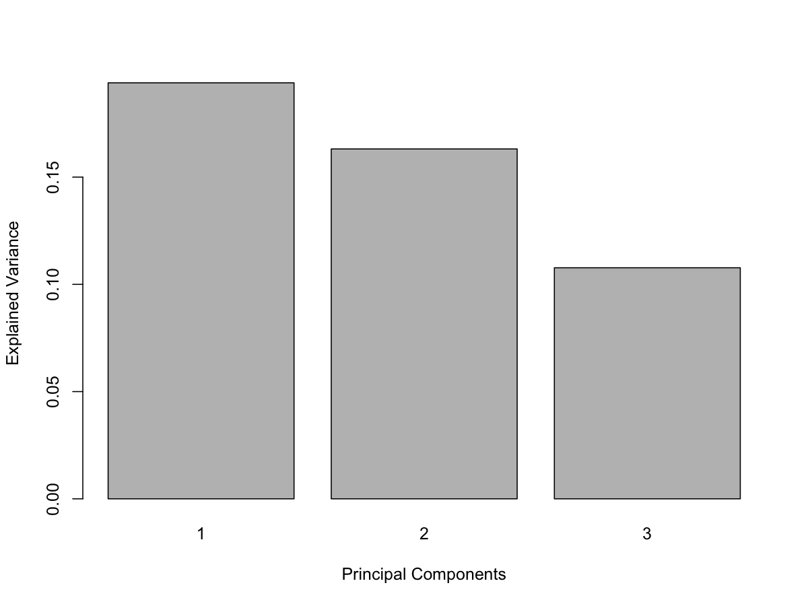
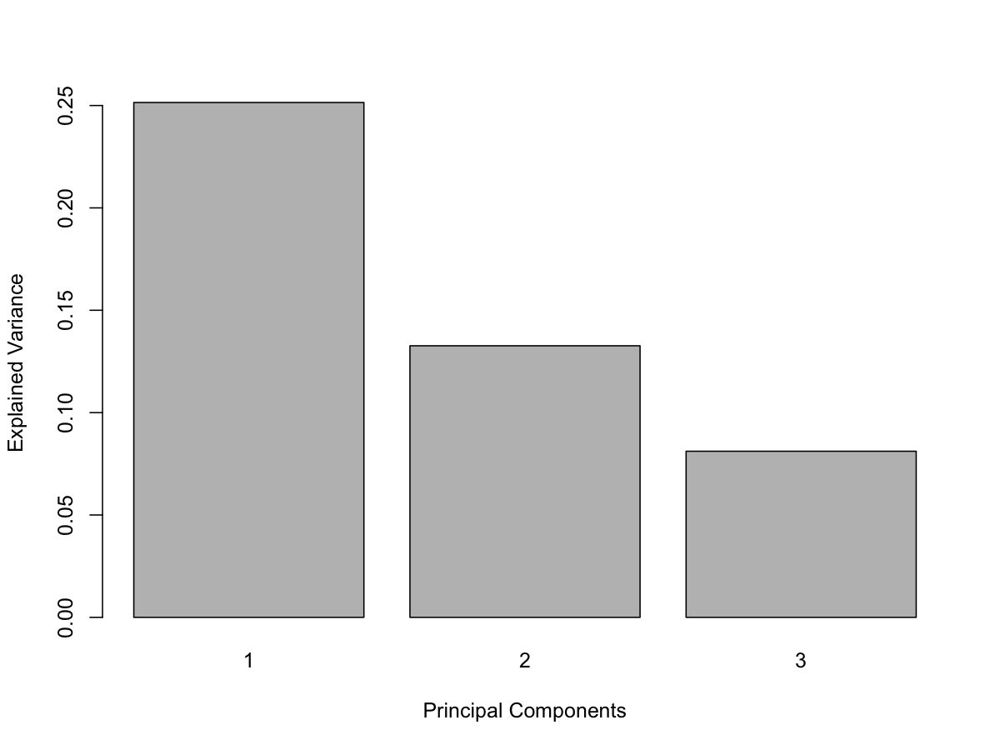
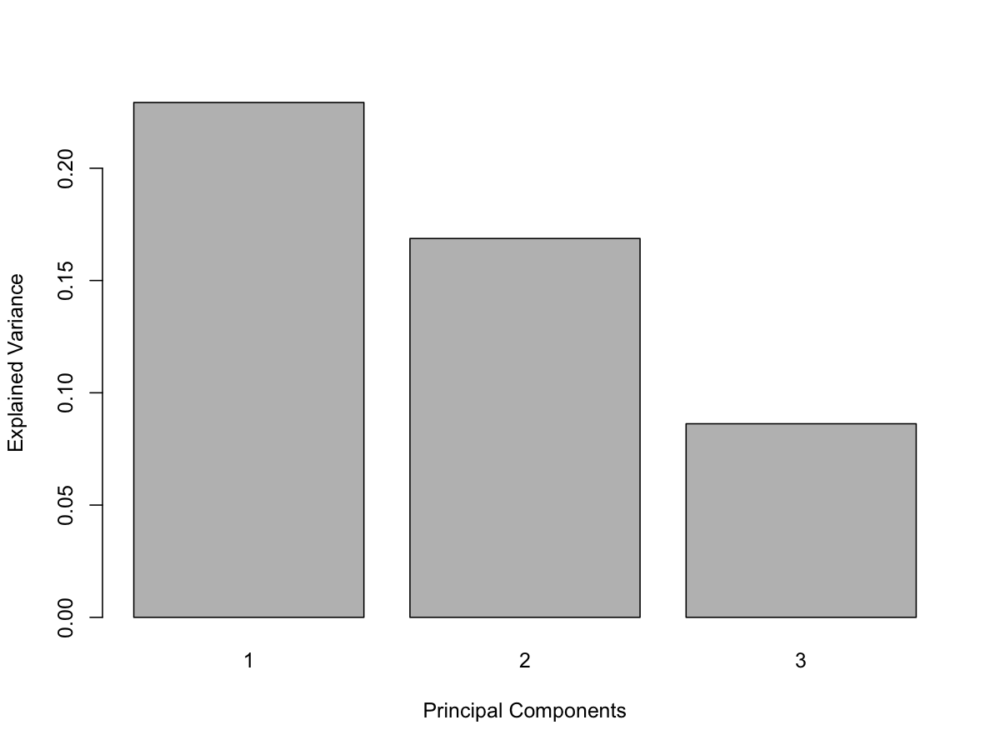
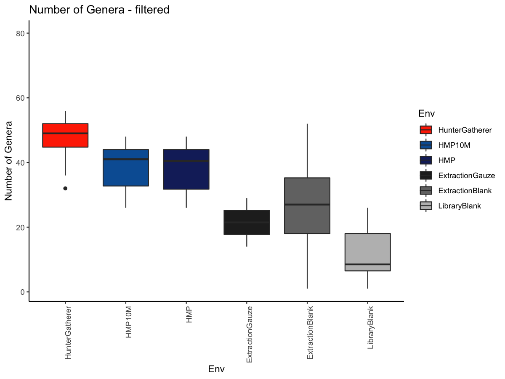

Cameroon hunter-gatherer calculus/plaque MALT
================
Irina Velsko
Oct 17, 2019

``` r
library(knitr)
library(decontam)
library(data.table)
library(psych)
library(mixOmics)
```

    ## Loading required package: MASS

    ## Loading required package: lattice

    ## Loading required package: ggplot2

    ## 
    ## Attaching package: 'ggplot2'

    ## The following objects are masked from 'package:psych':
    ## 
    ##     %+%, alpha

    ## 
    ## Loaded mixOmics 6.9.6
    ## Thank you for using mixOmics!
    ## Tutorials: http://mixomics.org
    ## Bookdown vignette: https://mixomicsteam.github.io/Bookdown
    ## Questions, issues: Follow the prompts at http://mixomics.org/contact-us
    ## Cite us:  citation('mixOmics')

    ## 
    ## Attaching package: 'mixOmics'

    ## The following object is masked from 'package:psych':
    ## 
    ##     pca

``` r
library(compositions)
```

    ## Loading required package: tensorA

    ## 
    ## Attaching package: 'tensorA'

    ## The following object is masked from 'package:base':
    ## 
    ##     norm

    ## Loading required package: robustbase

    ## 
    ## Attaching package: 'robustbase'

    ## The following object is masked from 'package:psych':
    ## 
    ##     cushny

    ## Loading required package: energy

    ## Loading required package: bayesm

    ## Welcome to compositions, a package for compositional data analysis.
    ## Find an intro with "? compositions"

    ## 
    ## Attaching package: 'compositions'

    ## The following object is masked from 'package:psych':
    ## 
    ##     ellipses

    ## The following objects are masked from 'package:stats':
    ## 
    ##     cor, cov, dist, var

    ## The following objects are masked from 'package:base':
    ## 
    ##     %*%, scale, scale.default

``` r
library(vegan)
```

    ## Loading required package: permute

    ## This is vegan 2.5-6

``` r
library(janitor)
```

    ## 
    ## Attaching package: 'janitor'

    ## The following objects are masked from 'package:stats':
    ## 
    ##     chisq.test, fisher.test

``` r
library(tidyverse)
```

    ## ── Attaching packages ────────────────────────────────────────────────────────────────────────────────────────────────────────────────────────── tidyverse 1.2.1 ──

    ## ✔ tibble  2.1.3     ✔ purrr   0.3.2
    ## ✔ tidyr   1.0.0     ✔ dplyr   0.8.3
    ## ✔ readr   1.3.1     ✔ stringr 1.4.0
    ## ✔ tibble  2.1.3     ✔ forcats 0.4.0

    ## ── Conflicts ───────────────────────────────────────────────────────────────────────────────────────────────────────────────────────────── tidyverse_conflicts() ──
    ## ✖ ggplot2::%+%()     masks psych::%+%()
    ## ✖ ggplot2::alpha()   masks psych::alpha()
    ## ✖ dplyr::between()   masks data.table::between()
    ## ✖ dplyr::filter()    masks stats::filter()
    ## ✖ dplyr::first()     masks data.table::first()
    ## ✖ dplyr::lag()       masks stats::lag()
    ## ✖ dplyr::last()      masks data.table::last()
    ## ✖ purrr::map()       masks mixOmics::map()
    ## ✖ dplyr::select()    masks MASS::select()
    ## ✖ purrr::transpose() masks data.table::transpose()

``` r
library(gplots)
```

    ## 
    ## Attaching package: 'gplots'

    ## The following object is masked from 'package:stats':
    ## 
    ##     lowess

``` r
library(ggrepel)
library(viridis)
```

    ## Loading required package: viridisLite

``` r
library(cowplot)
```

    ## 
    ## ********************************************************

    ## Note: As of version 1.0.0, cowplot does not change the

    ##   default ggplot2 theme anymore. To recover the previous

    ##   behavior, execute:
    ##   theme_set(theme_cowplot())

    ## ********************************************************

``` r
opts_chunk$set(echo=F, warning=F, message=F, dpi=150)
```

Set the working directory of the notebook to the parent directory of the
notebook itself.

# MALT read stats

The number of reads assigned in each sample appears very low (~50%). We
want to check this so we know how many were assinged in each sample. We
used the cleaned and merged reads that didn’t align to the human genome
(hg19), with the following database:
/projects1/malt/databases/indexed/index040/full-nt\_2017-10.

Before running decontam, let’s plot the samples in a PCA to see if there
are any that are clearly not
    good-quality

    ## Eigenvalues for the first 10 principal components, see object$sdev^2: 
    ##        PC1        PC2        PC3        PC4        PC5        PC6 
    ## 1023.71821  746.97935  439.32717  186.35221  167.00626  146.69319 
    ##        PC7        PC8        PC9       PC10 
    ##  127.11945   80.62765   74.12685   68.47391 
    ## 
    ## Proportion of explained variance for the first 10 principal components, see object$explained_variance: 
    ##        PC1        PC2        PC3        PC4        PC5        PC6 
    ## 0.22070014 0.16103889 0.09471314 0.04017508 0.03600435 0.03162512 
    ##        PC7        PC8        PC9       PC10 
    ## 0.02740528 0.01738226 0.01598077 0.01476207 
    ## 
    ## Cumulative proportion explained variance for the first 10 principal components, see object$cum.var: 
    ##       PC1       PC2       PC3       PC4       PC5       PC6       PC7 
    ## 0.2207001 0.3817390 0.4764522 0.5166273 0.5526316 0.5842567 0.6116620 
    ##       PC8       PC9      PC10 
    ## 0.6290443 0.6450250 0.6597871 
    ## 
    ##  Other available components: 
    ##  -------------------- 
    ##  loading vectors: see object$rotation

<!-- -->

    ## 
    ## Call:
    ##  tune.pca(X = malt_species_raw, logratio = "CLR") 
    ## 
    ##  for all principal components, see object$sdev, object$explained_variance and object$cum.var

<!-- --><!-- --><!-- -->

List the outliers in the plot above and remove them before running
decontam to ensure they’re not influencing the contaminant assessment.

# Decontamination with Decontam

We want to know if there are any species that can be removed b/c they
appear to be contaminants. Use the package decontam to determine which
species may be contaminants. Prepare the matrix for decontam.

Make a species abundance curve for the samples based on Env to get an
idea of the number of species identified in each prior to filtering, and
how long the tail is.
<!-- --><!-- -->

Now we’re ready to run Decontam. Start with the frequency method.

Try the prevalence method to compare.

    ## 
    ## FALSE  TRUE 
    ##   715   279

<!-- -->

    ## 
    ## FALSE  TRUE 
    ##   164   166

<!-- -->

Check the rank abundance curves to see how changing the cut-off
threshold changes the tail.
<!-- --><!-- -->

Check the combined prevalence and frequency method to see how it differs
from the individual methods.

We’ll use the prevalence method, because this doesn’t include known oral
taxa in the contaminant list (frequency method does), and it picks up a
lot more than the combined method does (but is that important if we cut
off the tail of low-abundance taxa (say \<0.01% abundance) anyway?). But
which cut-off to use? How does changing the cut-off affect the tail of
low-abundance taxa? List out the pathways that are considered
contaminants, to be removed from the table prior to all analyses. Then
remove them from the table to make the decontaminated input table for
analysis.

Let’s do a quick and not at all enough data filtering so we can run a
quick PCA to see if there are
    trends

    ## Eigenvalues for the first 10 principal components, see object$sdev^2: 
    ##        PC1        PC2        PC3        PC4        PC5        PC6 
    ## 1018.07092  790.09837  442.34966  187.25333  175.34410  145.61667 
    ##        PC7        PC8        PC9       PC10 
    ##  125.84831   76.28199   68.53666   64.21390 
    ## 
    ## Proportion of explained variance for the first 10 principal components, see object$explained_variance: 
    ##        PC1        PC2        PC3        PC4        PC5        PC6 
    ## 0.21901791 0.16997411 0.09516282 0.04028387 0.03772183 0.03132656 
    ##        PC7        PC8        PC9       PC10 
    ## 0.02707379 0.01641057 0.01474431 0.01381436 
    ## 
    ## Cumulative proportion explained variance for the first 10 principal components, see object$cum.var: 
    ##       PC1       PC2       PC3       PC4       PC5       PC6       PC7 
    ## 0.2190179 0.3889920 0.4841548 0.5244387 0.5621605 0.5934871 0.6205609 
    ##       PC8       PC9      PC10 
    ## 0.6369715 0.6517158 0.6655301 
    ## 
    ##  Other available components: 
    ##  -------------------- 
    ##  loading vectors: see object$rotation

<!-- -->

    ## 
    ## Call:
    ##  tune.pca(X = malt_species_unfiltered, logratio = "CLR") 
    ## 
    ##  for all principal components, see object$sdev, object$explained_variance and object$cum.var

<!-- --><!-- --><!-- --><!-- -->

    ## Eigenvalues for the first 10 principal components, see object$sdev^2: 
    ##       PC1       PC2       PC3       PC4       PC5       PC6       PC7 
    ## 767.51959 416.86486 370.05119 170.63904 140.26175 124.71619  96.51713 
    ##       PC8       PC9      PC10 
    ##  63.94569  60.36689  58.56787 
    ## 
    ## Proportion of explained variance for the first 10 principal components, see object$explained_variance: 
    ##        PC1        PC2        PC3        PC4        PC5        PC6 
    ## 0.22685128 0.12321031 0.10937387 0.05043478 0.04145635 0.03686163 
    ##        PC7        PC8        PC9       PC10 
    ## 0.02852700 0.01890005 0.01784229 0.01731056 
    ## 
    ## Cumulative proportion explained variance for the first 10 principal components, see object$cum.var: 
    ##       PC1       PC2       PC3       PC4       PC5       PC6       PC7 
    ## 0.2268513 0.3500616 0.4594355 0.5098703 0.5513266 0.5881882 0.6167152 
    ##       PC8       PC9      PC10 
    ## 0.6356153 0.6534576 0.6707681 
    ## 
    ##  Other available components: 
    ##  -------------------- 
    ##  loading vectors: see object$rotation

<!-- -->

    ## 
    ## Call:
    ##  tune.pca(X = malt_species_filtered, logratio = "CLR") 
    ## 
    ##  for all principal components, see object$sdev, object$explained_variance and object$cum.var

<!-- --><!-- --><!-- --><!-- -->

    ## Eigenvalues for the first 10 principal components, see object$sdev^2: 
    ##       PC1       PC2       PC3       PC4       PC5       PC6       PC7 
    ## 761.74382 640.66706 423.12506 169.78451 167.57569 133.78200 115.09711 
    ##       PC8       PC9      PC10 
    ##  69.09427  64.24407  61.36912 
    ## 
    ## Proportion of explained variance for the first 10 principal components, see object$explained_variance: 
    ##        PC1        PC2        PC3        PC4        PC5        PC6 
    ## 0.19396761 0.16313708 0.10774299 0.04323330 0.04267085 0.03406575 
    ##        PC7        PC8        PC9       PC10 
    ## 0.02930790 0.01759391 0.01635887 0.01562680 
    ## 
    ## Cumulative proportion explained variance for the first 10 principal components, see object$cum.var: 
    ##       PC1       PC2       PC3       PC4       PC5       PC6       PC7 
    ## 0.1939676 0.3571047 0.4648477 0.5080810 0.5507518 0.5848176 0.6141255 
    ##       PC8       PC9      PC10 
    ## 0.6317194 0.6480783 0.6637051 
    ## 
    ##  Other available components: 
    ##  -------------------- 
    ##  loading vectors: see object$rotation

<!-- -->

    ## 
    ## Call:
    ##  tune.pca(X = malt_species.decontam_unfilt, logratio = "CLR") 
    ## 
    ##  for all principal components, see object$sdev, object$explained_variance and object$cum.var

<!-- --><!-- --><!-- --><!-- -->

    ## Eigenvalues for the first 10 principal components, see object$sdev^2: 
    ##       PC1       PC2       PC3       PC4       PC5       PC6       PC7 
    ## 694.95821 366.57688 224.21861 147.96813 119.51998 107.97950  63.31580 
    ##       PC8       PC9      PC10 
    ##  58.35607  52.58097  51.60183 
    ## 
    ## Proportion of explained variance for the first 10 principal components, see object$explained_variance: 
    ##        PC1        PC2        PC3        PC4        PC5        PC6 
    ## 0.25147832 0.13264990 0.08113599 0.05354391 0.04324963 0.03907358 
    ##        PC7        PC8        PC9       PC10 
    ## 0.02291152 0.02111679 0.01902700 0.01867269 
    ## 
    ## Cumulative proportion explained variance for the first 10 principal components, see object$cum.var: 
    ##       PC1       PC2       PC3       PC4       PC5       PC6       PC7 
    ## 0.2514783 0.3841282 0.4652642 0.5188081 0.5620577 0.6011313 0.6240428 
    ##       PC8       PC9      PC10 
    ## 0.6451596 0.6641866 0.6828593 
    ## 
    ##  Other available components: 
    ##  -------------------- 
    ##  loading vectors: see object$rotation

<!-- -->

    ## 
    ## Call:
    ##  tune.pca(X = malt_species.decontam_filtered, logratio = "CLR") 
    ## 
    ##  for all principal components, see object$sdev, object$explained_variance and object$cum.var

<!-- --><!-- --><!-- --><!-- -->

    ## Eigenvalues for the first 10 principal components, see object$sdev^2: 
    ##       PC1       PC2       PC3       PC4       PC5       PC6       PC7 
    ## 166.79761 120.33279  81.64150  45.82782  28.49981  23.99635  22.17698 
    ##       PC8       PC9      PC10 
    ##  17.87567  16.55736  15.22355 
    ## 
    ## Proportion of explained variance for the first 10 principal components, see object$explained_variance: 
    ##        PC1        PC2        PC3        PC4        PC5        PC6 
    ## 0.23318006 0.16822308 0.11413335 0.06406647 0.03984222 0.03354647 
    ##        PC7        PC8        PC9       PC10 
    ## 0.03100302 0.02498986 0.02314690 0.02128225 
    ## 
    ## Cumulative proportion explained variance for the first 10 principal components, see object$cum.var: 
    ##       PC1       PC2       PC3       PC4       PC5       PC6       PC7 
    ## 0.2331801 0.4014031 0.5155365 0.5796030 0.6194452 0.6529916 0.6839947 
    ##       PC8       PC9      PC10 
    ## 0.7089845 0.7321314 0.7534137 
    ## 
    ##  Other available components: 
    ##  -------------------- 
    ##  loading vectors: see object$rotation

<!-- -->

    ## 
    ## Call:
    ##  tune.pca(X = malt_genus_filtered, logratio = "CLR") 
    ## 
    ##  for all principal components, see object$sdev, object$explained_variance and object$cum.var

<!-- --><!-- -->

    ## Eigenvalues for the first 10 principal components, see object$sdev^2: 
    ##       PC1       PC2       PC3       PC4       PC5       PC6       PC7 
    ## 121.39499  84.32361  40.53473  29.73980  26.05586  20.96774  17.12354 
    ##       PC8       PC9      PC10 
    ##  14.49634  12.87894  11.70767 
    ## 
    ## Proportion of explained variance for the first 10 principal components, see object$explained_variance: 
    ##        PC1        PC2        PC3        PC4        PC5        PC6 
    ## 0.24055079 0.16709184 0.08032177 0.05893103 0.05163112 0.04154873 
    ##        PC7        PC8        PC9       PC10 
    ## 0.03393123 0.02872529 0.02552032 0.02319940 
    ## 
    ## Cumulative proportion explained variance for the first 10 principal components, see object$cum.var: 
    ##       PC1       PC2       PC3       PC4       PC5       PC6       PC7 
    ## 0.2405508 0.4076426 0.4879644 0.5468954 0.5985265 0.6400753 0.6740065 
    ##       PC8       PC9      PC10 
    ## 0.7027318 0.7282521 0.7514515 
    ## 
    ##  Other available components: 
    ##  -------------------- 
    ##  loading vectors: see object$rotation

<!-- -->

    ## 
    ## Call:
    ##  tune.pca(X = malt_genus.decontam_filtered, logratio = "CLR") 
    ## 
    ##  for all principal components, see object$sdev, object$explained_variance and object$cum.var

<!-- --><!-- -->

    ## Eigenvalues for the first 10 principal components, see object$sdev^2: 
    ##       PC1       PC2       PC3       PC4       PC5       PC6       PC7 
    ## 750.95842 406.62557 190.96977 154.97207 133.06448 115.60819  64.45765 
    ##       PC8       PC9      PC10 
    ##  63.67872  57.70984  55.64011 
    ## 
    ## Proportion of explained variance for the first 10 principal components, see object$explained_variance: 
    ##        PC1        PC2        PC3        PC4        PC5        PC6 
    ## 0.25725124 0.13929524 0.06541935 0.05308784 0.04558309 0.03960319 
    ##        PC7        PC8        PC9       PC10 
    ## 0.02208086 0.02181403 0.01976931 0.01906029 
    ## 
    ## Cumulative proportion explained variance for the first 10 principal components, see object$cum.var: 
    ##       PC1       PC2       PC3       PC4       PC5       PC6       PC7 
    ## 0.2572512 0.3965465 0.4619658 0.5150537 0.5606367 0.6002399 0.6223208 
    ##       PC8       PC9      PC10 
    ## 0.6441348 0.6639041 0.6829644 
    ## 
    ##  Other available components: 
    ##  -------------------- 
    ##  loading vectors: see object$rotation

<!-- -->

    ## 
    ## Call:
    ##  tune.pca(X = malt_species.decontam_filtered_noblanks, logratio = "CLR") 
    ## 
    ##  for all principal components, see object$sdev, object$explained_variance and object$cum.var

<!-- --><!-- --><!-- --><!-- --><!-- --><!-- --><!-- -->

    ## Eigenvalues for the first 10 principal components, see object$sdev^2: 
    ##       PC1       PC2       PC3       PC4       PC5       PC6       PC7 
    ## 119.61989  88.02087  44.97865  29.04084  27.61160  22.50316  18.55999 
    ##       PC8       PC9      PC10 
    ##  15.32579  13.25851  12.37992 
    ## 
    ## Proportion of explained variance for the first 10 principal components, see object$explained_variance: 
    ##        PC1        PC2        PC3        PC4        PC5        PC6 
    ## 0.22927778 0.16871132 0.08621146 0.05566315 0.05292369 0.04313224 
    ##        PC7        PC8        PC9       PC10 
    ## 0.03557430 0.02937524 0.02541284 0.02372884 
    ## 
    ## Cumulative proportion explained variance for the first 10 principal components, see object$cum.var: 
    ##       PC1       PC2       PC3       PC4       PC5       PC6       PC7 
    ## 0.2292778 0.3979891 0.4842006 0.5398637 0.5927874 0.6359196 0.6714939 
    ##       PC8       PC9      PC10 
    ## 0.7008692 0.7262820 0.7500109 
    ## 
    ##  Other available components: 
    ##  -------------------- 
    ##  loading vectors: see object$rotation

<!-- -->

    ## 
    ## Call:
    ##  tune.pca(X = malt_genus.decontam_filtered_noblanks, logratio = "CLR") 
    ## 
    ##  for all principal components, see object$sdev, object$explained_variance and object$cum.var

<!-- --><!-- --><!-- --><!-- --><!-- --><!-- --><!-- -->
\# Alpha-diversity First we want to know if there are differences in the
total diveristy of identified species between *XXXMETADATAXXX*. We’ll
look at alpha-diversity for this, using both the observed species and
Shannon diverity metrics. Observed species to tell us which
*XXXMETADATAXXX* have more species/genera, and Shannon to tell us which
has more even distribution of species/genera.
<!-- --><!-- --><!-- --><!-- -->

<!-- --><!-- --><!-- --><!-- -->

Let’s also look specifically at evenness of the samples using Pielou’s
evenness. This calculation (derived from Shannon’s index) gives us a
number from 0 to 1, where 0 is no evenness and 1 is perfect evenness. We
want to see if there are any groups that have substantially greater
CAZyme evenness than the others, we’re not interested in what the actual
number is, or how even the samples appear to be, except relative to
eachother. After calculating plotting Pielou’s evenness, make histograms
to look at the evenness of CAZymes in each population.
<!-- --><!-- --><!-- --><!-- -->
The populations look pretty similar in evenness, which indicates that
the differnces in Shannon index are likely due to CAZyme richness
differences and not evenness differences.

Now alpha-diversity at the genus level
<!-- --><!-- --><!-- --><!-- -->

<!-- --><!-- --><!-- --><!-- -->

<!-- --><!-- --><!-- --><!-- -->

Now make a heatmap of the top 50 most abundant species (as an arbitrary
cut-off)
